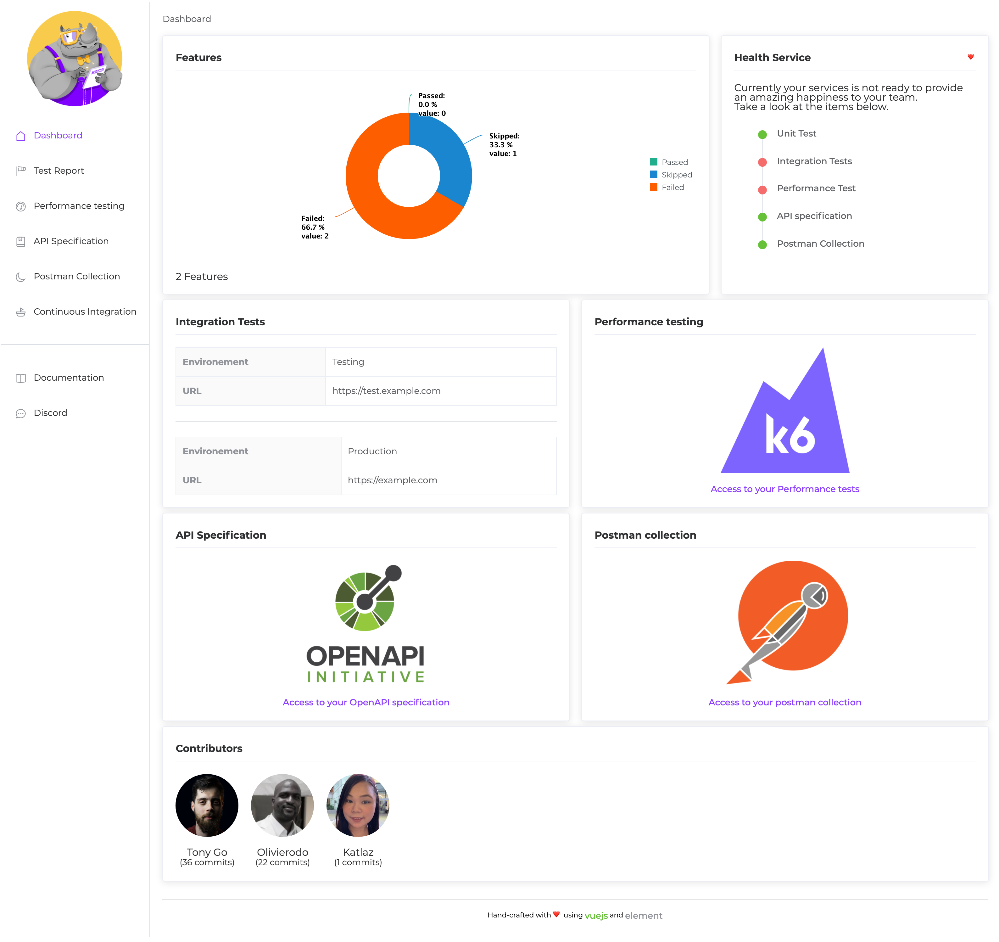

<p align="center"></p>
<h1 align="center">RestQA</h1>
<h3 align="center">Test Driven Happiness</h3>
<p align="center">Making engineer happy by applying world class developer experience to any Microservices</p>
<p align="center">
  <a href="https://www.npmjs.com/package/@restqa/restqa"></a>
  <a href="https://nodejs.org/en/about/releases/"></a>
  <a href="https://github.com/restqa/restqa/actions/workflows/build.yml"></a>
  <a href="https://hub.docker.com/r/restqa/restqa"></a>
  <a href="https://restqa.io/chat"></a>
</p>
<p align="center">
    <a href="https://docs.restqa.io">📖 Documentation</a>
</p>

## 😃 Why Test Driven Happiness?

Within our DEV team while working with microservice, we realized a few thing:

- [X] **WE HATE** Writting Unit Test
- [X] **WE HATE** Reviewing long unreadable Unit Test
- [X] **WE HATE** Maintaining the Integration Test
- [X] **WE HATE** Maintainig the Performance Test
- [X] **WE HATE** Maintainig the API specification
- [X] **WE HATE** Maintaining the postman collection

This is why we decided to challenge ourself on how to transform this anger into a positive initative.
RestQA was build with a simple goal Driving the happiness of the DEV team through testing.

Run one command and get everything that you need to enjoy maintaining your microservice.


#### Screenshot




## ⭐️ Features

- 🌈 Unit test as Single source of truth
- 💬 Write unit test using ordinary language
- 🚦 Reuse your unit test to run the integration test
- 🏎  Generate Test scenario for your favorite Performance testing tool
- 📚  Generate an up to date API specification from the test results
- 👩‍🚀 Generate an up to date postman collection
- 🕐 Instant result
- 👑 Programming language Agnostic
- 👩‍💻 Community Driven


## 📦 Install

```
npm install -D @restqa/restqa
```

```
yarn add @restqa/restqa -D
```

## 🎯 Usage

In you `package.json` add the script:

```
  "scripts": {
    "test": "restqa run",
    "happy": "restqa run --report"
  }

```

Write a Unit Test Using ordinary language:

```gherkin
Feature: GET /api/infos

Scenario: Get the list of informations
Given I have the api gateway
  And I have the path "/api/info"
  And I have the method "GET"
When I run the API
Then I should receive a response with the status 200
  And the response body should be equal to:
  """
{
  "message": "Hello World!"
}
  """
```

Then simply run the command:

```
npm run happy
```


## 🌈 Example

Take a look at the [example folder](./example) to see a basic setup.

More example available on the [restqa-example](https://github.com/restqa/restqa-example) repository.

## 🚧 Roadmap

##### 🚀 Unit Test

- [X] Mock external http depedencies
- [ ] Mock MongoDB database
- [ ] Mock Postgres database
- [ ] Mock MySQL database
- [ ] Mock S3 database

##### 🚦 Integration Test

- [X] Slack (alerting)
- [X] Discord (alerting)
- [X] Mattermost (alerting)
- [X] Slack (alerting)
- [X] Slack (alerting)
- [X] Slack (alerting)
- [ ] Kibana (Monitoring)
- [ ] Grafana (Monitoring)
- [X] Excel (Data)
- [X] Google Sheet (Data)
- [X] File system (Data)

##### 🏎 Performance Test

- [X] Artillery.io
- [ ] K6
- [ ] Jmeter
- [ ] Vegeta

#### 📚 API Specification

- [X] Swagger
- [ ] Redoc

#### 👩‍🚀 API Collection

- [ ] Postman
- [ ] Insomnia
- [ ] hoppscotch

#### 📦 Continuous integration

- [X] Github Action
- [X] Gitlab CI
- [X] Jenkins
- [X] Circle CI
- [X] Travis CI
- [X] Bitbucket Pipeline
- [X] Docker
- [ ] Azure pipeline


## Contribution

See [Contributing Guide](./CONTRIBUTING.md).

## License

[MIT License](./LICENSE)

