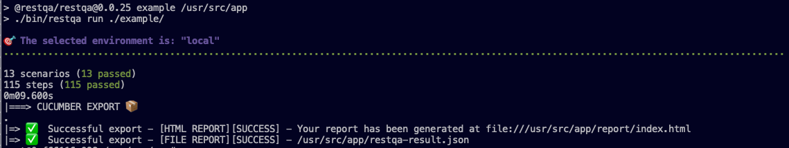
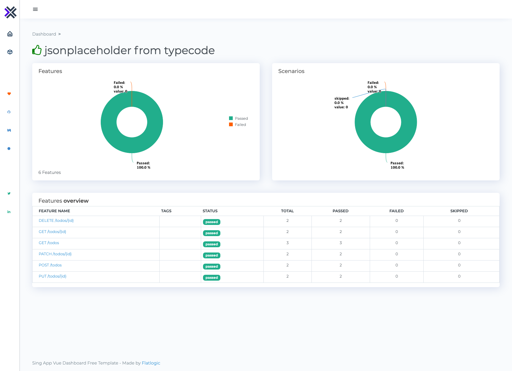

# RestQA Example

> A Drive thru example for all of us that like Fast Food

Hello,
Thank you for your interest on RestQA, let us explain to you what you can find on this folder.

### Good to know 

RestQA is based on Gherkin / Cucumber and using the .feature files. It will be bonus for you if you have exposed to the BDD/ATDD practice, it will help you to understand the full vision of RestQA.

## Description

This example is a set of test automation scenarion that are testing the famous: https://jsonplaceholder.typicode.com
In this exampple we are just sharing the test automation for the `todos` resources. (GET, DELETE, POST, PUT, PATCH)

## File Structure

This folder is containing a few files:

* `.restqa.yml`: The RestQA configuration file.
* `tests/integration/get-todos.feature`: Test scenario of the endpoint GET /todos
* `tests/integration/get-todos-id.feature`: Test scenario of the endpoint GET /todos/{id}
* `tests/integration/post-todos.feature`: Test scenario of the endpoint POST /todos
* `tests/integration/patch-todos.feature`: Test scenario of the endpoint PATCH /todos/{id}
* `tests/integration/put-todos.feature`: Test scenario of the endpoint PUT /todos/{id}
* `tests/integration/delete-todos.feature`: Test scenario of the endpoint DELETE /todos/{id}

## Run the example

In order to run the test just use the command :

```
npm run example
```

Which is an alias of `restqa run example`

Then the result will be:




And you will be able to access to the report on your browser :




That it! This is short but this is what RestQA is about, An easy Test Automation sideckick.

---

More information:

* Docs: https://docs.restqa.io
* Website: https://restqa.io
* Twitter: https://twitter.com/restqa
* Linkedin: https://linkedin.com/company/restqa
* Blog: https://medium.com/restqa
