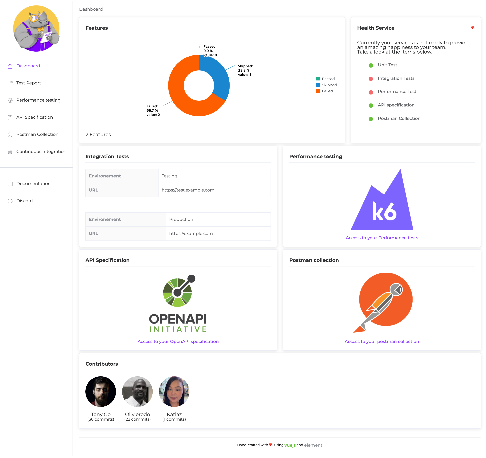
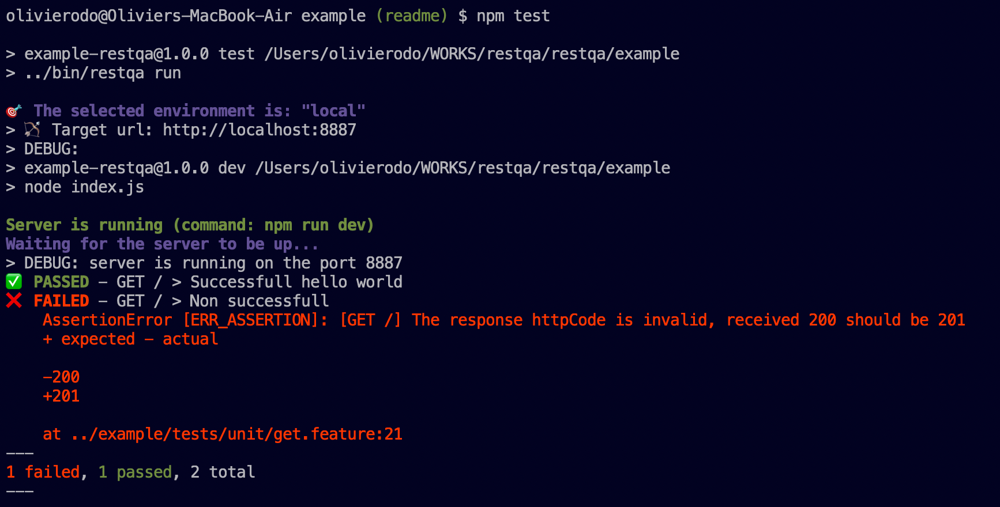

# RestQA NodeJS Example 🚀

Hello 👋,

Thank you for your interest on RestQA, let us explain to you what you can find on this folder.

## 🗽 Description

In this exampple we are just sharing the test automation for the `/` resources. (GET)

## 📚 File Structure

This folder is containing a few files:

* `index.js`: The actual microservice code that required to be tested.
* `.restqa.yml`: The RestQA configuration file.
* `tests/local/get.feature`: Test scenario of the endpoint GET /

## 🎯 Run the example

First you will need to install the dependencies to get the microservice to run properly

```
npm i
```

### 1. Full happiness report

In order to run the test and get a full report available run the command:

```
npm run happy
```

Example of the report:




### 2. Local test only

```
npm test
```



This command will just run the unit test without creating the report, it become handful for dev mode.

